# Architecture

This document describes the implemented architecture of `bgmeter` at version
0.3.0: three independently packaged Python source bases (a protocol-neutral
core, a MicroTech driver, and a command-line frontend) colocated in this
repository. The root `gocheck.py` is only a deprecated compatibility launcher
for the CLI.

Related documents:

- [`docs/DEVELOPMENT.md`](docs/DEVELOPMENT.md): development, packaging, test, and
  hardware-smoke procedures.
- [`docs/superpowers/specs/2026-09-20-verbosity-and-logging-design.md`](docs/superpowers/specs/2026-09-20-verbosity-and-logging-design.md):
  design of the progress-reporting and logging layers.
- [`KNOWLEDGEBASE.md`](KNOWLEDGEBASE.md): protocol findings for the MicroTech
  meters.

Diagrams are [Mermaid](https://mermaid.js.org/) and render on GitHub. In class
diagrams `T?` means "optional", `~T~` is a generic parameter, and
`<<module>>` marks a module of functions rather than a class.

## Contents

1. [Goals](#goals)
2. [Protocol boundary](#protocol-boundary)
3. [System overview](#system-overview)
4. [Core library](#core-library)
5. [Data model](#data-model)
6. [MicroTech driver](#microtech-driver)
7. [Command-line interface](#command-line-interface)
8. [Progress reporting and logging](#progress-reporting-and-logging)
9. [Failure and completeness model](#failure-and-completeness-model)
10. [Repository and package boundaries](#repository-and-package-boundaries)

## Goals

- Provide a transport-neutral, asynchronous Python library for discovering
  compatible blood glucose meters and reading their stored measurements.
- Keep each meter protocol behind a common driver interface.
- Publish that driver interface as part of the stable core API so independent
  packages can add meter support without modifying the core or CLI.
- Discover meters without assuming that the connected device is a particular
  GoChek or Wellion unit, and allow callers to select a specific discovered
  device.
- Preserve raw protocol evidence alongside normalized, human-readable records
  so captures can be reinterpreted as protocol knowledge improves.
- Keep the command-line interface and output formatting separate from device
  communication.

## Protocol boundary

Bluetooth Low Energy, GATT, and the Device Information Service are generic
standards. The FFE0/FFE1 service, framing, command `0x05`, indexed history
requests, checksums, fragmentation, and 18-byte history records documented for
the current meter are a proprietary MicroTech protocol. They may be shared by
other MicroTech OEM/rebranded products, but they are not a general blood glucose
meter protocol.

The device-specific implementation is `MicroTechBgmDriver`. GoChek and Wellion
names identify known compatible product variants; they do not define the generic
library interface. A future meter that implements the Bluetooth SIG Glucose
Service would use a separate driver, such as `StandardBleGlucoseDriver`.

## System overview

### Component view

Dependencies point downwards. The CLI and the MicroTech driver depend only on the
public `bgmeter` API of the core; neither imports a private core module, and the
core knows nothing about either of them. The MicroTech driver reaches the CLI and
other applications only through the `bgmeter.drivers` Python entry-point group.

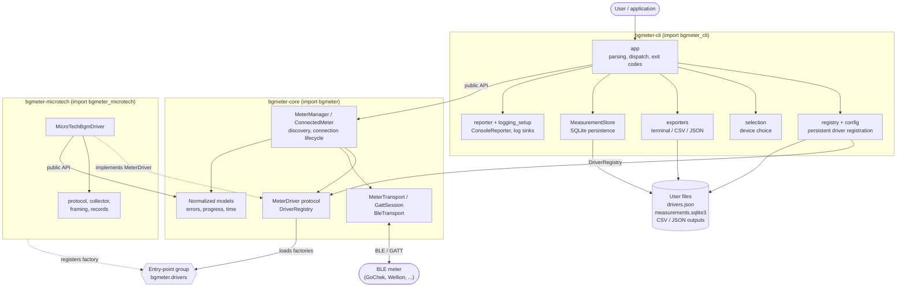

| Distribution | Import package | Runtime dependencies |
| --- | --- | --- |
| `bgmeter-core` | `bgmeter` | `bleak`, `tzlocal`, `tzdata` (Windows only) |
| `bgmeter-microtech` | `bgmeter_microtech` | `bgmeter-core` |
| `bgmeter-cli` | `bgmeter_cli` | `bgmeter-core`, `bgmeter-microtech`, `platformdirs` |

All three require Python 3.13 or newer. The CLI depends on the MicroTech
distribution so a default installation ships GoChek/Wellion support, but it never
imports it: the driver is found through the entry point like any other.

### Design rules

- **One direction of dependency.** Core is unaware of drivers and frontends;
  drivers and frontends use only the top-level `bgmeter` namespace.
- **Drivers never open transports.** `MeterManager` owns connection lifecycle and
  injects a connected `TransportSession` into the driver.
- **Transports never interpret meter data.** They move bytes and describe GATT
  inventories.
- **Frontends never touch protocol bytes.** They consume normalized
  `ReadResult` data; raw evidence is opaque provenance.
- **Immutability.** Public models are frozen dataclasses with read-only mapping
  fields.

## Core library

### Public API

The API is async-only. Applications that need a synchronous interface can
provide their own event-loop boundary; the CLI hides async operation from
terminal users.

`MeterManager` is the central entry point. A caller discovers `MeterDevice`
objects through the manager and opens a selected device as an async context
manager. The resulting `ConnectedMeter` is bound to one live transport session
and guarantees cleanup. The top-level `discover_meters()` and `read_meter()`
functions give the same behavior for one-shot use with a default manager
(`MeterManager.default()`), which registers every driver entry point installed in
the environment and uses `BleTransport`.

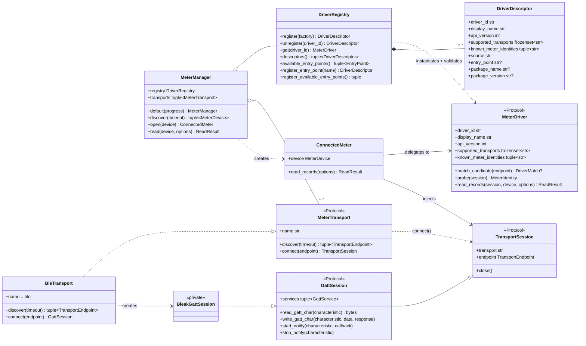

Public API surface is the names exported from `bgmeter/__init__.py`: the manager
and helper functions, the driver protocol/registry, transport protocols and
`BleTransport`, all models, all errors, the progress types, and
`interpret_meter_datetime`.

### Meter drivers

`MeterDriver` is the transport-neutral interface implemented by every supported
meter family. A driver identifies compatible discovery candidates, reads device
metadata, and retrieves records through an injected transport session.

`MeterDriver` and every type required to implement it are part of the stable,
documented core API (`DRIVER_API_VERSION = 1`). Implementations must not import
private core modules. Each driver declares a stable ID, a display name, the
driver API version, the transports it supports, and the meter identities it is
known to work with.

Identification has two stages:

1. A synchronous, side-effect-free `match_candidate()` inspects discovery
   metadata (advertised service UUIDs, device name) and returns a `DriverMatch`
   with an integer confidence and textual evidence, or `None`.
2. An async `probe()` runs on a connected session to confirm identity (for
   example from the Device Information Service) and returns a `MeterIdentity`.
   It raises `UnsupportedDeviceError` if the endpoint turns out not to be a
   meter the driver handles.

`read_records()` accepts `ReadOptions` (timezone, per-request timeout, retry
count, optional progress callback, and two optional read hints) and returns a
`ReadResult`. The hints are `newest_count`, which asks for at most that many of
the most recent records, and `known_record_ids`, the record IDs the caller
already holds, which a driver may use to stop reading at the first one it
reaches. A driver may honor or ignore either hint; a driver that ignores them
simply returns the full history.

`DriverRegistry` validates every factory before accepting it: the factory must be
callable and produce an object with a non-empty string `driver_id` and
`display_name`, `api_version == DRIVER_API_VERSION`, a `frozenset` of string
transport names, a `tuple` of string identities, a callable `match_candidate`,
and *async* `probe` and `read_records`. Duplicate driver IDs are rejected.

### Transports

A transport adapter owns physical discovery and byte transfer. `BleTransport`
scans for advertisements, connects with `bleak`, enumerates GATT services,
subscribes to notifications, and reads/writes characteristics. It converts
`bleak` failures into `DiscoveryError`, `MeterConnectionError`, or
`MeterTimeoutError`, and it does not interpret glucose measurements or MicroTech
packets. Scanner and client factories are injectable, so tests and other
applications can substitute them. This composition allows future drivers to
reuse BLE without inheriting MicroTech behavior and permits future non-BLE
transports.

### Driver registration

The registry accepts explicitly supplied driver factories and discovers installed
driver packages through the `bgmeter.drivers` entry-point group. An entry point
resolves to a driver factory; the registry loads it, validates it, and records a
`DriverDescriptor` that includes the package name and version. Loading all entry
points (`register_available_entry_points()`) never aborts on one bad package:
failures are logged and returned in an error map keyed by entry-point name.

`DriverRegistry` instances are isolated and process-local: applications can build
one for tests or embed additional drivers without modifying global state. The
MicroTech driver registers through this same mechanism and is not special-cased
anywhere in the core. A future driver package can depend only on the published
core package, implement `MeterDriver`, expose a factory under the entry-point
group, and become available to both applications and the CLI.

The CLI layers *persistent* registration on top (see
[CLI driver registration](#driver-registration-in-the-cli)); the core registry
itself is stateless.

### Discovery and identification

`MeterManager.discover()` asks each transport for endpoints, then identifies each
endpoint against the drivers that support that transport. Identification
connects to the endpoint to run the driver's `probe()`, so discovery briefly
connects to every candidate that some driver matched.

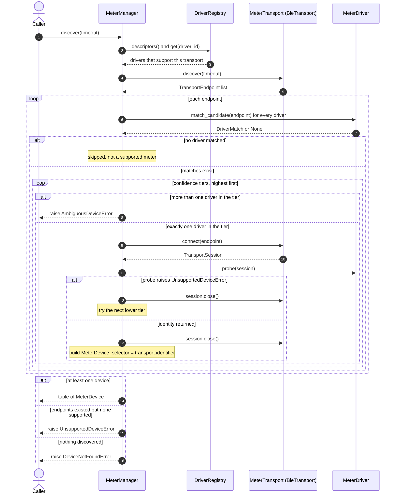

Two drivers claiming an endpoint with equal confidence is an error, never a
silent choice. A `MeterDevice` carries the endpoint, the confirmed identity, the
driver ID, the match evidence, and the stable selector `transport:identifier`
(for example `ble:AA-BB-CC-DD-EE-FF`) that non-interactive callers pass back.

### Reading and session lifecycle

`MeterManager.open(device)` resolves the transport and the driver, checks that the
driver supports the transport, connects, and yields a `ConnectedMeter`. A shared
session scope closes the session on every path: if the body failed, cleanup runs
and any cleanup error is attached to the original exception as a note; if the
body succeeded, a disconnect failure is raised as a (private) close error.

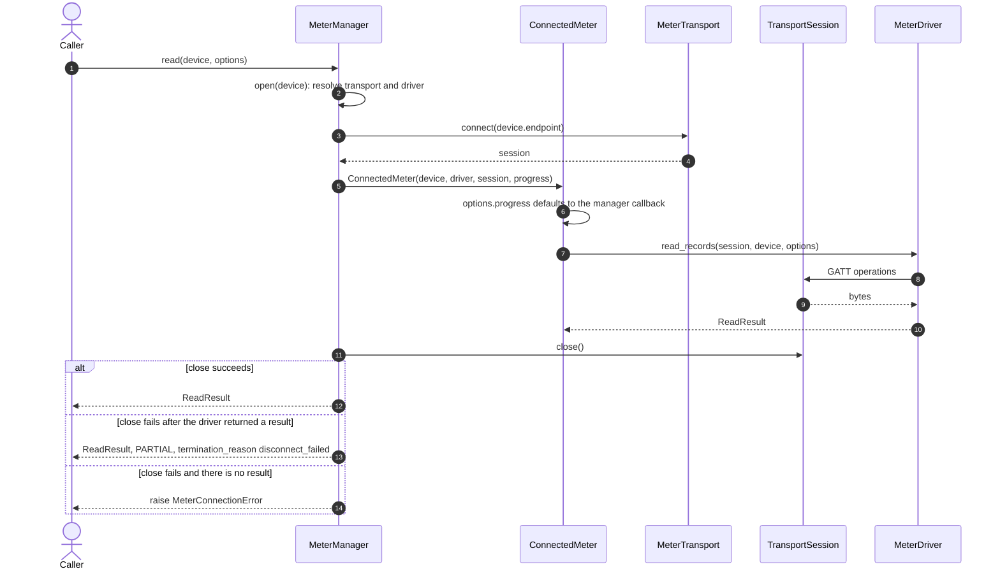

The manager takes an optional progress callback and passes it to the driver as
`ReadOptions.progress` unless the caller already set one, so neither the
`MeterDriver` protocol nor `DRIVER_API_VERSION` had to change to support
progress.

## Data model

Drivers return vendor-neutral `GlucoseRecord` objects collected in a
`ReadResult`. Nothing in the model is meter-specific; driver-specific decoded
values live in namespaced `driver_data` and `diagnostics` mappings.

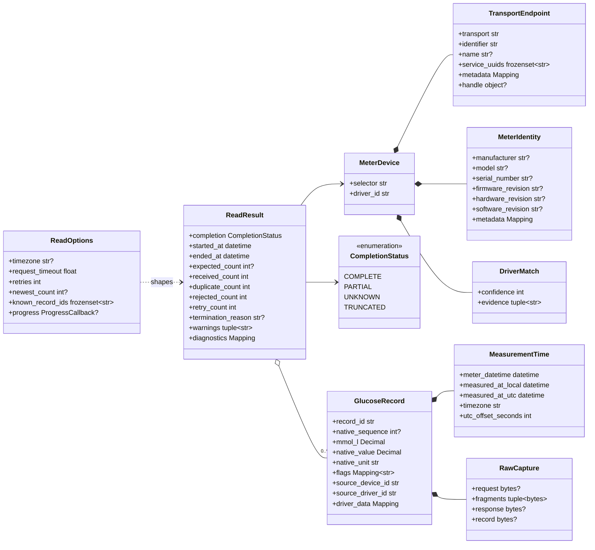

Metadata mappings accept a bounded set of value types (scalars, `bytes`,
`Decimal`, dates, `UUID`, and nested mappings/sequences/sets of the same), are
frozen recursively into read-only structures on construction, and reject cycles
and non-`str`/`int` keys. This is what lets the JSON exporter serialize any
driver's metadata without knowing the driver.

### Timestamps

The MicroTech meter stores only a manually maintained local wall-clock value; it
does not provide a timezone or evidence of clock synchronization. The library and
CLI assume that this clock was set correctly. `interpret_meter_datetime()`
attaches an IANA zone (defaulting to the host system zone via `tzlocal`) to the
timezone-unspecified value and produces a `MeasurementTime`:

- `meter_datetime`: the timezone-unspecified date and time decoded verbatim;
- `measured_at_local`: that value interpreted in the selected zone;
- `measured_at_utc`: the corresponding UTC time; and
- the zone name and UTC offset used for the interpretation.

The original value is always retained so a record can be reinterpreted if the
meter clock or timezone assumption later proves wrong. A value that already
carries a timezone is rejected.

### Provenance and ordering

Every record retains `RawCapture` provenance: the request bytes that elicited
it, the notification fragments, the reconstructed response, and the native record
bytes. Records in a result are unique by `record_id` and presented in
measurement-time order. `ReadResult` carries completeness state, counts
(expected, received, duplicate, rejected, retry), a structured termination reason,
warnings, and driver diagnostics, so partial retrieval is never mistaken for a
complete history, and a deliberately shortened read is never mistaken for either.

## MicroTech driver

`bgmeter_microtech` owns all knowledge specific to the MicroTech protocol:

- FFE0/FFE1 service and characteristic recognition;
- MicroTech frame encoding, escaping, checksums, and fragmentation;
- command `0x05` indexed history requests and completion detection;
- 18-byte BGM history record decoding;
- duplicate suppression, request/response attribution, and raw protocol capture.

Protocol codecs and packet collectors are private implementation details of the
driver rather than requirements imposed on other drivers. The public surface is
`MicroTechBgmDriver` and `driver_factory`, the latter registered under the entry
point `microtech` in group `bgmeter.drivers`.

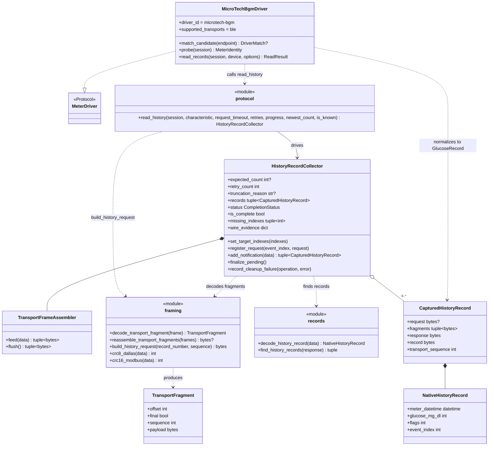

### Identification

`match_candidate()` returns confidence 100 if the endpoint advertises the FFE0
service, and 80 if the device name contains `gochek` or `wellion`; it returns
`None` otherwise. `probe()` requires a BLE `GattSession` that exposes FFE0 with an
FFE1 characteristic (otherwise `UnsupportedDeviceError`), then reads the standard
Device Information Service (manufacturer, model, serial, firmware, hardware,
software revisions) into a `MeterIdentity`; the System ID characteristic goes into
identity metadata as `microtech.system_id`. An unreadable characteristic is logged
and skipped rather than failing the probe.

### Wire protocol layers

```mermaid
flowchart LR
    n["BLE notification<br/>at most 20 bytes"] --> a["TransportFrameAssembler<br/>joins notifications into frames<br/>delimiter 2d 2d, escape 2f"]
    a --> f["decode_transport_fragment<br/>unescape, length check,<br/>CRC-8 header check"]
    f --> p["pending transmission<br/>keyed by 6-bit sequence<br/>fragments keyed by offset"]
    p --> r["reassemble_transport_fragments<br/>complete when final fragment seen<br/>and all bytes covered"]
    r --> t["response token<br/>bytes 2..3 matched to a<br/>registered request token"]
    t --> h["find_history_records<br/>scan every offset for a valid<br/>18-byte record"]
    h --> v{"attribution"}
    v -->|accepted| ok["CapturedHistoryRecord<br/>keyed by event_index"]
    v -->|"rejected_* or duplicate_*"| ev["wire evidence and counters<br/>no record"]
```

A notification holds at most 20 bytes, but escaping can push one frame past that,
so the assembler rebuilds frames from a stream of notifications and hands
anything that does not form a delimited frame to the collector as invalid.

A request is a command `0x05` frame with a two-byte big-endian record number: the
inner packet carries a CRC-16/Modbus and the outer header a CRC-8/Dallas. Record
number `0` asks for the latest record and therefore the history length. Each
request's token is registered with the collector, which attributes replies to
requests by that token.

The collector runs in *strict live mode*: it accepts a response only if its token
matches the request that was active when its first fragment arrived, and (for
non-zero requests) only the requested event index. Every reassembled transmission
gets a verdict, retained as evidence:

| Attribution | Meaning |
| --- | --- |
| `accepted` | New record stored under its event index |
| `duplicate_identical` / `duplicate_conflict` | Index already held, with identical or different bytes (a conflict counts as rejected) |
| `rejected_pre_write` | Arrived before any request was written |
| `rejected_unmatched_token` / `rejected_token_mismatch` | Token matches no request, or a different request generation |
| `rejected_wrong_event` | Valid record, but not the one requested |
| `rejected_empty_response` | Reassembled, but contained no valid record |
| `rejected_invalid_notification` / `rejected_conflicting_fragment` / `rejected_malformed_transmission` | Damaged framing or inconsistent fragments |
| `rejected_superseded_*` / `rejected_incomplete_generation` | An incomplete transmission was abandoned |
| `mixed` | One transmission carried records with different verdicts |

Because a six-bit sequence number is not a generation identifier, a fragment at
offset zero arriving for an already-started transmission supersedes the older
one rather than being merged with it.

### History retrieval

`read_history()` subscribes to FFE1 notifications and asks for the latest record
to learn the history length N. It then plans which indexes to fetch and requests
them newest first, from N downwards, rather than from 1 upwards. With no limits
the targets are N down to 1. `newest_count` raises the lowest target to
`max(1, N - newest_count + 1)`. The optional `is_known(index)` predicate is asked
about each candidate index in turn from N downwards, and the plan stops at the
first index it reports as known: that index and everything older are not
requested. When the targets are fewer than the whole history the collector
records why in `truncation_reason`: `limit_reached` when `newest_count` cut the
plan short, or `already_stored` when a known record did. The driver builds the
known-record test from `history_record_id(device, event_index)` in
`bgmeter_microtech.driver`, which is also how normalization forms `record_id`.
Every request is retried up to `retries` times, waiting up to `request_timeout`
seconds for the predicate to hold. Notification reception is always stopped, on
success and on error.

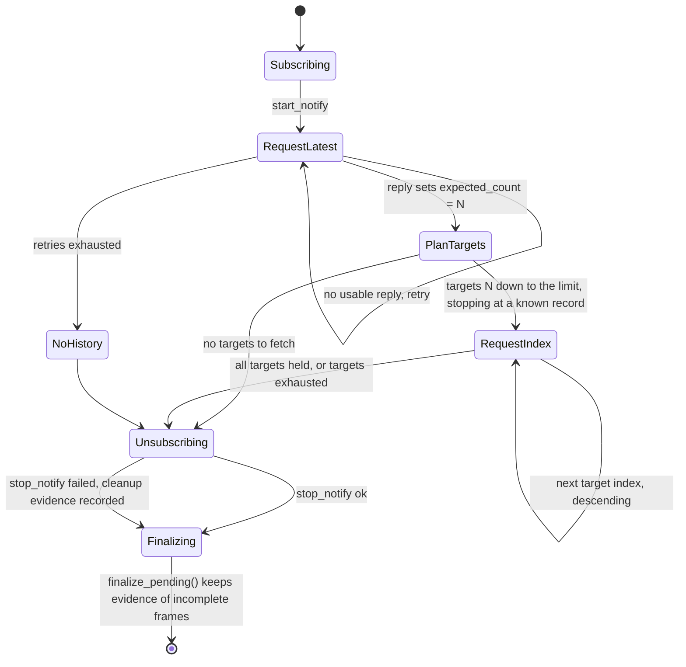

An index that stays unanswered after all retries is skipped, not fatal: the read
continues and the result reports the missing indexes among those it targeted.
The collector's `is_complete` means that every targeted index was received, not
that the whole history was; whether the targets covered the whole history decides
between `COMPLETE` and `TRUNCATED` (see
[Completion states](#completion-states)). Failures that propagate as
exceptions (a failed GATT write, cancellation) abort the read, run cleanup, and
raise a typed error; records collected so far are not returned in that case.

### Normalization

`MicroTechBgmDriver.read_records()` maps each accepted native record to a
`GlucoseRecord`:

- `record_id` is `microtech-bgm:<selector>:<event_index>`, so it is stable across
  reads and unique per meter;
- glucose is stored natively in `mg/dL` and converted to mmol/L (divide by 18,
  quantized to 0.01);
- the timezone-unspecified meter time goes through `interpret_meter_datetime()`;
- the flag byte becomes named booleans (`hypo`, `hyper`, `ketone`, `pre_meal`,
  `post_meal`, `invalid`, `control_solution`);
- undecoded native fields (temperature, reserved bytes, event port/type/level/value,
  transport sequence) go under `driver_data["microtech"]`; and
- the raw request, fragments, response, and 18-byte record go into `RawCapture`.

Records whose ID is in `ReadOptions.known_record_ids` are dropped before
normalization, so a read that stopped at a known record returns only what is new
and `received_count` counts only those records. `expected_count` still reports
the meter's true total.

The result's `diagnostics` carry `microtech.*` counters, the missing event
indexes, the truncation reason, and the full wire evidence. If the meter
connects but yields no usable record, the driver raises `MeterTimeoutError`.

## Command-line interface

`bgmeter` is a frontend over the public library, not the home of protocol logic.
Its source imports only the documented `bgmeter` API.

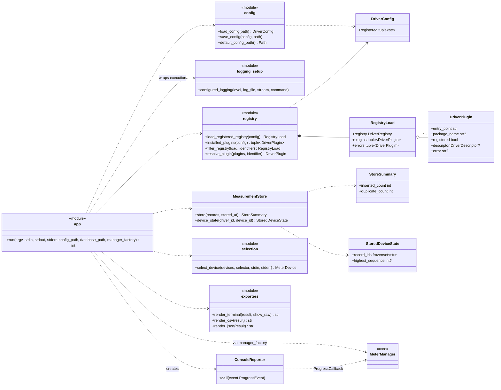

### Command surface

```text
bgmeter [-v|-vv] [-l LEVEL] [-L PATH] COMMAND ...

bgmeter devices  [--driver DRIVER]
bgmeter info     --device DEVICE [--driver DRIVER]
bgmeter read     [-d DEVICE] [-D DRIVER] [-z ZONE]
                 [-o OUTPUT]... [-r] [-s] [-m MESSAGE] [-n N] [-N] [-f]
bgmeter drivers list [--available | --registered]
bgmeter drivers info DRIVER
bgmeter drivers register DRIVER
bgmeter drivers unregister DRIVER
```

The reporting options (`-v`, `--log-level`, `--log-file`) are accepted both before
and after the subcommand; verbosity adds up to a maximum of 2 and a value given
after the subcommand wins for level and file. `--driver` restricts the operation
to one compatible registered driver; `--device` takes the stable selector shown
by `bgmeter devices`.

Device selection: with `--device` the selector must match exactly one discovered
device. Without it, a non-interactive run fails; an interactive run auto-selects a
single device and otherwise prints a numbered menu on stderr and reads the choice
from stdin.

### `read` pipeline

```mermaid
flowchart TD
    start(["bgmeter read"]) --> parse["Parse arguments,<br/>attach logging sink,<br/>create ConsoleReporter"]
    parse --> cfg["Load drivers.json,<br/>build DriverRegistry from<br/>registered entry points"]
    cfg --> filt{"--driver given?"}
    filt -->|yes| one["Restrict registry to that driver"]
    filt -->|no| all["Use all registered drivers"]
    one --> disc
    all --> disc["asyncio.run:<br/>manager.discover()"]
    disc --> sel["select_device()"]
    sel --> out["Parse --output specs and<br/>check destinations up front<br/>at most one stdout output,<br/>existing files need --force"]
    out --> nw{"--new-only?"}
    nw -->|yes| ds["MeasurementStore.device_state()<br/>read-only, never creates the database<br/>on failure: status 6"]
    nw -->|no| rd
    ds --> rd["manager.read(device,<br/>ReadOptions(timezone, newest_count,<br/>known_record_ids))"]
    rd --> rs{"--new-only and the meter reports fewer records<br/>than the highest stored sequence?"}
    rs -->|yes| rw["stderr: history appears reset or cleared,<br/>hint: run a full read"]
    rs -->|no| msg["Load saved messages for returned records;<br/>apply -m to the latest record"]
    rw --> msg
    msg --> st{"--store?"}
    st -->|yes| db["MeasurementStore.store(records, messages)<br/>on failure: no output is published, status 6"]
    st -->|no| rend
    db --> rend["Render every output<br/>in memory first"]
    rend --> pub["Publish: write files atomically,<br/>then write stdout output"]
    pub --> cmp{"completion COMPLETE or TRUNCATED?"}
    cmp -->|yes| ok(["exit 0"])
    cmp -->|no| warn(["stderr: retrieval is partial / unknown<br/>exit 5"])
```

Output specs are `terminal` (default), `csv[=PATH]`, and `json[=PATH]`, repeatable
so one retrieval can feed several exporters. All outputs are rendered before any
is published; file outputs are written to a temporary file, fsynced, and moved
into place, so a failed render or store leaves no partial files. Existing files
are protected unless `--force` is given. Progress and diagnostics use stderr so
machine-readable stdout stays clean.

A partial or unknown retrieval still exports the records obtained, marks the
result incomplete, and returns status `5`. A truncated retrieval exports the
records obtained and returns `0` with no warning; `ConnectedMeter` announces it
with one INFO-level progress line, shown only with `-v`, either "No new records."
or "Read N records. Older records were not read."

`--newest N` asks the driver for at most the N most recent records; a value below
1 is a usage error (status `2`). `--new-only` reads the measurement database
(`measurements.sqlite3`) before the read to learn which records the selected meter already has:
`MeasurementStore.device_state()` returns the stored record IDs and the highest
stored sequence, and the IDs become `ReadOptions.known_record_ids`, so the driver
stops at the first record it already has. The database is read whether or not
`--store` is given, so `--new-only` can preview what is new without recording it.
It never creates the database, so on a machine with none it is a full read, and a
database that cannot be read fails the command with status `6` before the read
starts. Because the walk stops at the first known record, `--new-only` does not
fill gaps left by an earlier interrupted read; a full read does. If the meter
reports fewer records than the highest sequence in the database, the command
warns on stderr that the meter's history appears to have been reset or cleared
and hints to run a full read, without changing the exit status. That guard is a
heuristic: it compares the meter's reported count with the highest stored
sequence, so it can only detect a meter that now reports fewer records than were
previously stored. The two flags can be combined.

### Driver registration in the CLI

The CLI keeps a persistent enabled-driver list in `drivers.json` under the
per-user config directory (schema `bgmeter.driver-registration`, version 1). It
stores entry-point *names*, not code or paths, and defaults to `["microtech"]`.
A third-party driver must first be installed with normal Python packaging tools;
the CLI never downloads or installs executable packages.

On every invocation the CLI resolves the saved names against the installed entry
points, builds a fresh core `DriverRegistry`, and lets the core validate each
driver. Problems (uninstalled entry point, duplicate names, incompatible API
version) are reported once each as `warning: driver ...` on stderr and do not
block the other drivers.

- `drivers list` shows every installed entry point with package, registration
  state, and compatibility (`--available` restricts to installed, `--registered`
  to registered ones).
- `drivers info` shows metadata: entry-point value, package, driver ID, API
  version, transports, known identities, compatibility. It exits `2` for an
  incompatible driver.
- `drivers register` resolves an installed entry point, then validates the
  resulting registration set (including conflicts with already-registered drivers)
  before saving.
- `drivers unregister` removes it from the saved list; it never uninstalls a
  package.

### Exporters

Exporters live in the CLI source base. They consume only the public normalized
`ReadResult` and know nothing about drivers.

- **Terminal** is human-oriented: a header, one line per record with the value in
  mmol/L (one decimal) and local and UTC times, an indented raw-bytes line with
  `--show-raw`, and warnings. It is not a stable machine-readable schema.
- **JSON** is the lossless, versioned representation. The document has schema
  name `bgmeter.read-result` and integer `schema_version` 2, and contains
  completion statistics, device identity, records, warnings, and diagnostics.
  Decimals are strings to avoid floating-point alteration; `bytes` become
  hexadecimal (`{"$bytes_hex": ...}` inside metadata, `*_hex` fields for raw
  capture).
- **CSV** has one record per row with stable columns: `record_id`,
  `native_sequence`, `mmol_l`, `native_value`, `native_unit`, `meter_datetime`,
  `measured_at_local`, `measured_at_utc`, `timezone`, `utc_offset_seconds`,
  `flags_json`, `message`, `source_device_id`, `source_driver_id`, `raw_request_hex`,
  `raw_fragments_json`, `raw_response_hex`, `raw_record_hex`, `driver_data_json`.
  Nested values use compact JSON inside a cell.

Healthcare-specific formats such as FHIR are deferred; the exporter interface
leaves room for them without changing the library or drivers.

### Measurement store

`--store` persists the normalized records of a read to a per-user SQLite database
(`measurements.sqlite3` in the user data directory). Reads do not write a
database unless asked. The store happens before any output is rendered or
published and also covers the valid records of a partial result; a failure aborts
the command with status `6`.

`MeasurementStore` owns its path, schema-version check (`PRAGMA user_version`,
currently 2), connection lifecycle, and single write transaction. Records are
deduplicated solely by the public driver-scoped `record_id`. Raw captures, driver
metadata, and diagnostics stay in the JSON export and are not stored. The store
moves a database from the former platform-default location into the current one on
the first write. `device_state()` is read-only: it never creates the file, never
migrates the legacy path, and raises `StoreError` on an unsupported or zero-byte
database. A v1 database gains the nullable `measurements.message` column on its
next write. A supplied `-m` message is applied only to the latest record returned
by the meter; existing messages are otherwise retained. Message lookup is
best-effort for rendering, so without usable stored message data only that latest
record has the newly supplied message.

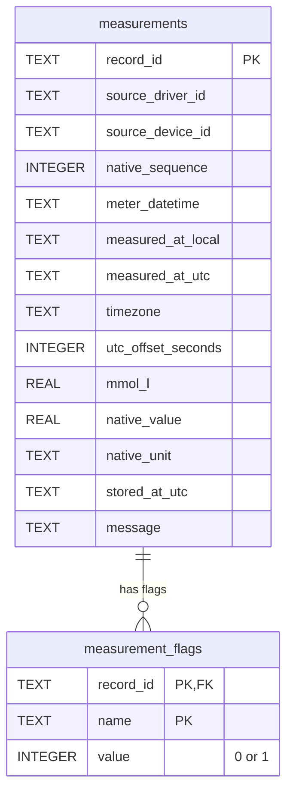

## Progress reporting and logging

Two independent mechanisms; neither reads or filters the other.

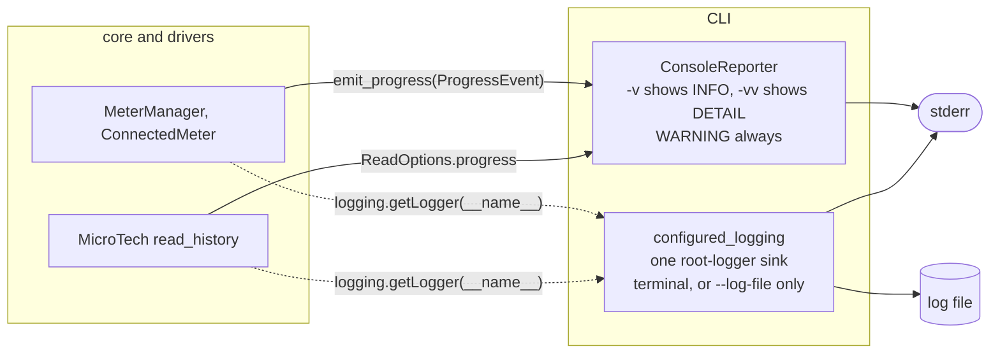

**Progress** is user-facing. Core defines `ProgressEvent(level, message, current,
total)`, `ProgressLevel` (`INFO`, `DETAIL`, `WARNING`), `ProgressCallback`, and
`emit_progress`, which never lets a missing or failing callback affect the
caller. `MeterManager` hands its callback to drivers as `ReadOptions.progress`
(an explicit caller value wins), so the `MeterDriver` protocol and
`DRIVER_API_VERSION` are unchanged. Messages are plain ASCII sentences without
protocol jargon. Within user-facing output a condition is reported by one line: a
command-ending failure by the CLI's `error:`/`hint:` lines and a non-complete read
by its single `retrieval is ...` line, so managers and drivers emit no progress
event restating either. A truncated read is neither, and `ConnectedMeter` reports
it with one `INFO` line. The CLI's `ConsoleReporter` shows `WARNING` always, `INFO`
with `-v`, and `DETAIL` with `-vv` (prefixed with elapsed time), throttles
counters to the first, last, and each 10% step, and writes to stderr.

**Logging** is developer-facing stdlib `logging` with `getLogger(__name__)` in
every module; `bgmeter` and `bgmeter_microtech` install only a `NullHandler`.
ERROR: a failure the layer absorbs instead of raising. WARNING: a recoverable
problem. INFO: milestones, never glucose values or serial numbers. DEBUG:
byte-level detail (GATT reads/writes, requests, notifications as hex, per-reply
verdicts). A layer never logs an exception it re-raises; the CLI logs the final
failure once (an ERROR line plus a DEBUG traceback). Log text is technical and
never restates a progress sentence. The CLI attaches one sink to the root logger:
the terminal by default, or `--log-file` exclusively (with a version/platform
header line), at `--log-level` (`debug`, `info`, `warning`, or `error`; default
`error`), and restores the logger afterwards.

## Failure and completeness model

### Completion states

`ReadResult.completion` has four states:

- `COMPLETE`: the driver can positively establish that it received the full
  available history;
- `PARTIAL`: retrieval ended early or the driver knows records are missing,
  including a shortened read that missed some of the records it targeted;
- `UNKNOWN`: valid records were retrieved but the protocol cannot prove that the
  history is complete; and
- `TRUNCATED`: the read delivered every record it was asked for, and that was
  deliberately fewer than the meter's whole history because `newest_count` was
  reached or a known record was. `expected_count` still reports the meter's true
  total. Unlike `PARTIAL` and `UNKNOWN`, this is a success: the CLI exits `0`
  with no warning.

For MicroTech the state follows from the collector:

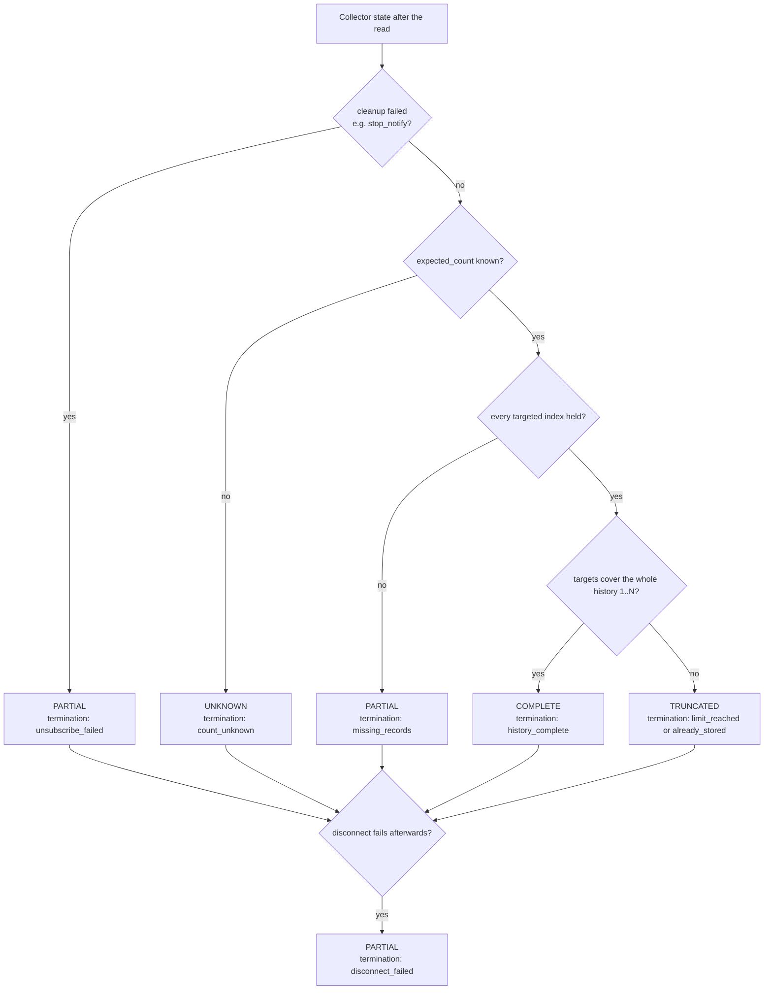

The collector's targets are every index 1..N unless `read_history()` declared a
smaller set, so `is_complete` and the missing indexes are relative to what the
read targeted. The result records expected, received, duplicate, rejected, and
retry counts when known, plus a structured termination reason and the missing
event indexes.
Duplicate events contribute to diagnostics but never appear more than once in the
normalized records.

### Errors

A failure before any trustworthy result raises a typed exception. Corrupt or
malformed individual replies are retried when safe and retained as diagnostics.
Valid records are returned as a partial result when requests go unanswered,
indexes are missing, notification cleanup fails, or the final disconnect fails; an
exception raised mid-read (for example a failed GATT write) propagates and no
result is returned. Cancellation propagates after transport cleanup.

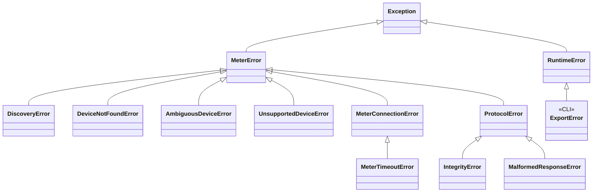

The core families are under `MeterError`. The CLI adds `ExportError` (also used
for measurement-store and driver-configuration write failures), plus selection,
driver-selection, configuration, and log-file errors that map to usage failures.

### CLI exit statuses

| Status | Meaning | Raised by |
| --- | --- | --- |
| `0` | Complete or truncated success | |
| `2` | Usage or ambiguous selection | Argument errors, `SelectionError`, `DriverSelectionError`, `ConfigError`, `AmbiguousDeviceError`, unopenable log file, `drivers info` on an incompatible driver |
| `3` | No supported meter | `DeviceNotFoundError`, `UnsupportedDeviceError` |
| `4` | Transport or connection failure | `DiscoveryError`, `MeterConnectionError` |
| `5` | Timeout, protocol failure, or non-complete retrieval | `MeterTimeoutError`, `ProtocolError`, partial/unknown `ReadResult` |
| `6` | Export or storage failure | `ExportError`, `StoreError` |
| `130` | Interrupted | `KeyboardInterrupt`, cancellation |

`MeterTimeoutError` subclasses `MeterConnectionError` but is deliberately mapped to
`5`. Handled failures print `error: <message>` and, where useful, a plain-language
`hint:` to stderr. An unclassified exception is not swallowed: it propagates as a
programming error.

## Repository and package boundaries

The generic core, MicroTech driver, and CLI are separate Python source bases
colocated in this repository for now. Each is independently buildable,
installable, versioned, and testable, so any directory can later move to its own
repository without restructuring Python packages or tests.

```text
core/                                   bgmeter-core
    pyproject.toml
    README.md
    src/bgmeter/
        __init__.py                     public API surface, NullHandler
        drivers.py                      MeterDriver, DriverRegistry, descriptors
        manager.py                      MeterManager, ConnectedMeter, helpers
        models.py                       immutable public data models
        errors.py                       MeterError hierarchy
        progress.py                     ProgressEvent/Level/Callback, emit_progress
        time.py                         interpret_meter_datetime
        transports/
            base.py                     transport and GATT session protocols
            bleak.py                    BleTransport (bleak adapter)
    tests/

drivers/microtech/                      bgmeter-microtech
    pyproject.toml                      entry point: bgmeter.drivers -> microtech
    README.md
    src/bgmeter_microtech/
        __init__.py
        driver.py                       MicroTechBgmDriver, driver_factory
        protocol.py                     read_history retrieval loop
        collector.py                    HistoryRecordCollector, attribution
        framing.py                      checksums, escaping, fragment assembly
        records.py                      native 18-byte record decoding
    tests/
        fixtures/                       saved captures
        hardware/                       opt-in live-meter smoke test

cli/                                    bgmeter-cli
    pyproject.toml                      console script: bgmeter
    README.md
    src/bgmeter_cli/
        __main__.py                     module and console-script entry point
        app.py                          parsing, dispatch, outputs, exit statuses
        config.py                       drivers.json persistence
        registry.py                     entry-point inspection, registry building
        selection.py                    device selection
        store.py                        MeasurementStore (SQLite)
        reporter.py                     ConsoleReporter
        logging_setup.py                log sinks
        exporters/                      terminal.py, csv.py, json.py
    tests/

gocheck.py                              deprecated launcher for the CLI
docs/                                   development guide, design specs and plans
```

The core distribution exposes the `bgmeter` import package and the public driver
implementation interface. The MicroTech distribution exposes `bgmeter_microtech`,
depends only on the public core API, and registers `MicroTechBgmDriver` through the
standard driver entry point. This repository's default CLI installation depends
on both distributions, thereby shipping GoChek/Wellion support while keeping the
CLI itself driver-neutral.

Package metadata uses normal versioned dependencies (`bgmeter-core>=0.2,<0.3`)
rather than relative path dependencies. Monorepo development installs core, then
the MicroTech driver, then the CLI (see
[`docs/DEVELOPMENT.md`](docs/DEVELOPMENT.md)).

Persistent CLI registration belongs to the CLI source base and is separate from
the stateless core registry.

Tests and fixtures live with the source base they verify. Core tests cover
models, transports, discovery, registry behavior, progress, and the public driver
contract. MicroTech tests cover framing, parsing, protocol behavior, saved
captures, and conformance with that public contract. CLI tests cover argument
handling, selection, exit statuses, exporters, storage, and reporting by using
public core APIs or public-interface fakes; they do not import driver internals.
No shared private test-helper package crosses a source-base boundary.
